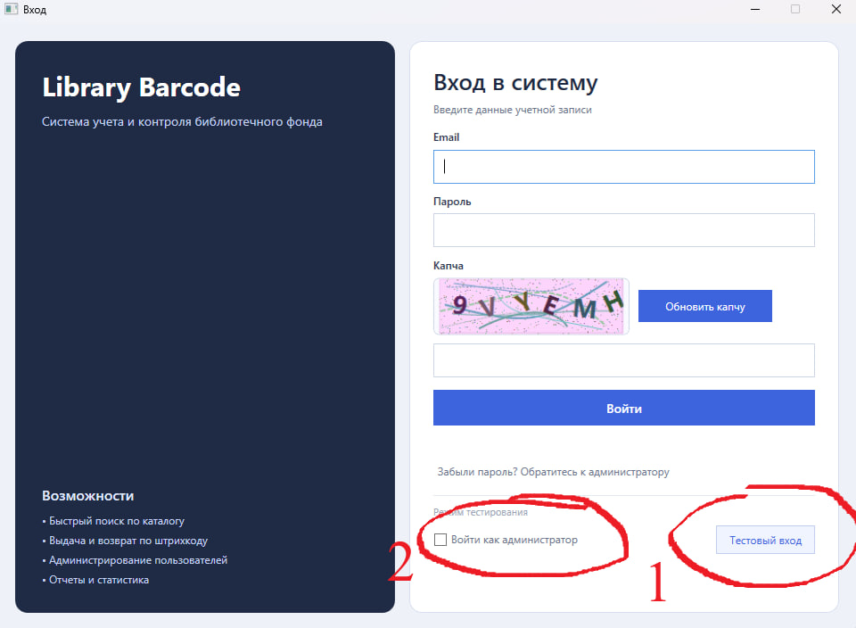
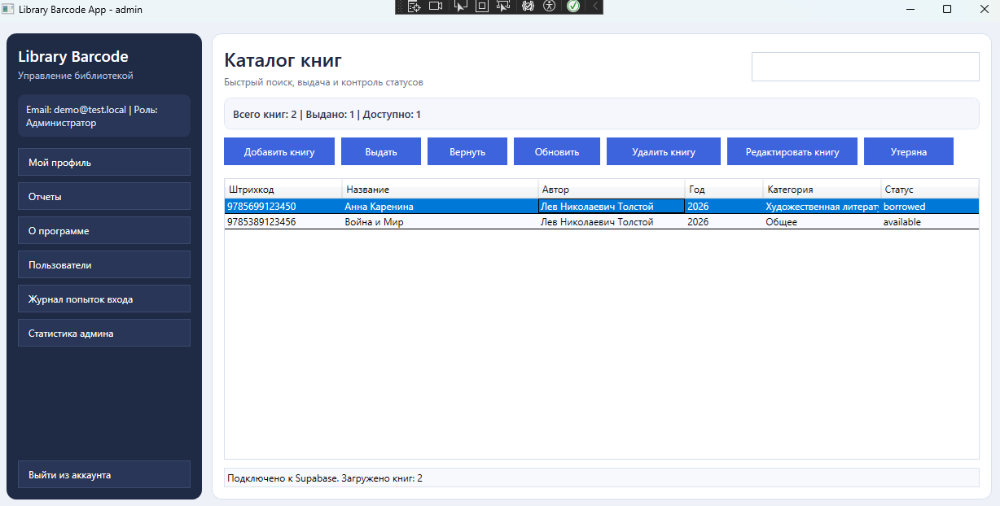
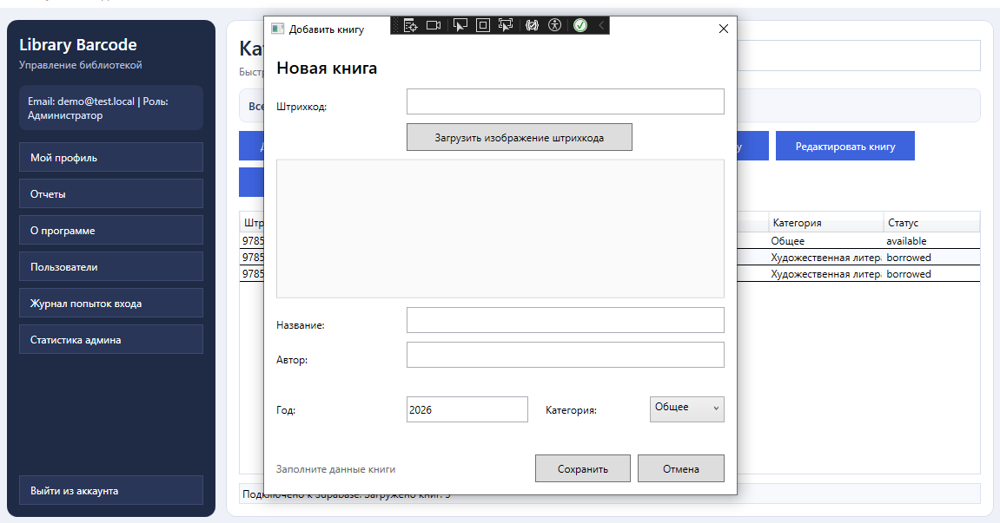
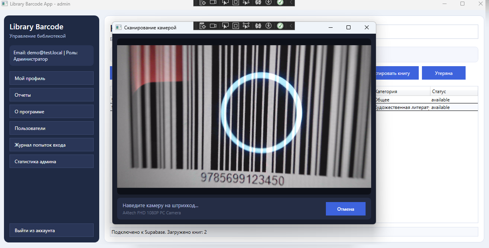

# Library Barcode App

WPF-приложение для автоматического учёта и подсчёта книг в библиотеке с использованием штрихкодов.

---

## Скриншоты


| Экран входа | Главное окно |
|---|---|
|  |  |

| Добавление книги | Сканирование камерой |
|---|---|
|  |  |

---

## Возможности

- **Авторизация** — вход по email/паролю через Supabase Auth, капча, блокировка пользователей
- **Разграничение прав** — роли `admin` и `employee`, часть функций доступна только администратору
- **Каталог книг** — просмотр, поиск и фильтрация по названию, автору, штрихкоду
- **Добавление книг** — ввод вручную или распознавание штрихкода с изображения
- **Выдача и возврат** — сканирование через веб-камеру или загрузка фото штрихкода
- **Штрихкоды** — генерация и декодирование (ZXing.Net, форматы CODE_128, EAN и др.)
- **Управление пользователями** — создание, блокировка, сброс паролей (только admin)
- **Отчёты** — статистика по категориям и статусам книг
- **Облачное хранилище** — все данные в Supabase (PostgreSQL)
- **Тестовый вход** — режим обхода авторизации для демонстрации и тестирования

---

## Технологии

| Компонент | Технология |
|---|---|
| UI-фреймворк | WPF (.NET 8, Windows) |
| Архитектурный паттерн | MVVM |
| База данных | Supabase (PostgreSQL) |
| Аутентификация | Supabase Auth |
| Штрихкоды | ZXing.Net.Bindings.Windows.Compatibility |
| Камера | AForge.Video.DirectShow |
| Сериализация | Newtonsoft.Json |

---

## Требования

- Windows 10 / 11
- [.NET 8 Runtime](https://dotnet.microsoft.com/download/dotnet/8.0)
- Аккаунт [Supabase](https://supabase.com) с настроенным проектом
- Веб-камера (опционально, для сканирования в реальном времени)

---

## Установка и запуск

### 1. Получить проект

Скопируйте папку проекта или клонируйте свой репозиторий:

```bash
git clone <URL-репозитория>
cd BookScan
```

### 2. Настроить подключение к Supabase

Скопировать шаблон конфигурации и заполнить своими ключами:

```bash
cp LibraryBarcodeApp/appsettings.example.json LibraryBarcodeApp/appsettings.json
```

Открыть `LibraryBarcodeApp/appsettings.json` и заполнить:

```json
{
  "Supabase": {
    "Url": "https://YOUR_PROJECT_ID.supabase.co",
    "ApiKey": "YOUR_ANON_PUBLIC_KEY",
    "ServiceRoleKey": "YOUR_SERVICE_ROLE_KEY_FOR_ADMIN_OPERATIONS"
  }
}
```

Ключи находятся в Supabase Dashboard → **Project Settings → API**.

> `ServiceRoleKey` нужен только для административных операций (создание/удаление пользователей из приложения). Для базового использования можно оставить пустым.

### 3. Создать структуру базы данных

В Supabase Dashboard → **SQL Editor** выполнить скрипты для создания таблиц:

```sql
-- Профили пользователей
create table profiles (
  id uuid primary key references auth.users(id),
  full_name text,
  role text default 'employee',
  is_active boolean default true
);

-- Книги
create table books (
  id uuid primary key,
  barcode text unique not null,
  title text not null,
  author text not null,
  year integer,
  category text,
  status text default 'available',
  created_at timestamptz default now()
);

-- Операции (выдача/возврат)
create table operations (
  id uuid primary key,
  book_id uuid references books(id),
  operation_type text not null,
  timestamp timestamptz default now()
);

-- Журнал попыток входа
create table login_attempts (
  id uuid primary key,
  email text not null,
  success boolean,
  timestamp timestamptz default now()
);

-- Блокировка по email
create table blocked_emails (
  id uuid primary key default gen_random_uuid(),
  email text unique not null,
  is_blocked boolean default true
);
```

### 4. Собрать и запустить

```bash
dotnet build LibraryBarcodeApp/LibraryBarcodeApp.csproj
dotnet run --project LibraryBarcodeApp/LibraryBarcodeApp.csproj
```

Или открыть `BookScan.sln` в Visual Studio 2022+ и запустить через F5.

---

## Использование

### Вход

- Ввести email и пароль учётной записи из Supabase Auth
- Пройти капчу
- **Тестовый вход** (кнопка внизу) — позволяет войти без учётных данных в режиме сотрудника или администратора

### Сканирование штрихкода

При нажатии **«Выдать»** или **«Вернуть»** открывается диалог выбора способа:

- **📷 Камера** — открывает окно с живым изображением с веб-камеры; штрихкод распознаётся автоматически
- **🖼 Изображение** — выбор файла PNG/JPG/BMP с изображением штрихкода

### Добавление книги

1. Нажать **«Добавить книгу»**
2. Загрузить изображение штрихкода (штрихкод будет распознан автоматически) **или** ввести код вручную
3. Заполнить название, автора, год, категорию
4. Нажать **«Сохранить»**

---

## Структура проекта

```
BookScan/
├── LibraryBarcodeApp/
│   ├── Commands/           # RelayCommand (MVVM)
│   ├── Configuration/      # SupabaseSettings
│   ├── Converters/         # WPF-конвертеры
│   ├── Helpers/            # BarcodeHelper (декодирование)
│   ├── Models/             # Book, User, Operation, Profile и др.
│   ├── Services/           # SupabaseService, BarcodeScanService, CaptchaService
│   ├── ViewModels/         # MainWindowViewModel, AddBookViewModel и др.
│   ├── appsettings.example.json   # Шаблон конфигурации
│   ├── AddBookWindow.xaml
│   ├── CameraWindow.xaml          # Окно сканирования камерой
│   ├── LoginWindow.xaml
│   ├── MainWindow.xaml
│   ├── ScanSourceDialog.xaml      # Диалог выбора способа сканирования
│   └── ...
└── README.md
```

---

## Лицензия

Учебный проект. Свободное использование в образовательных целях.
